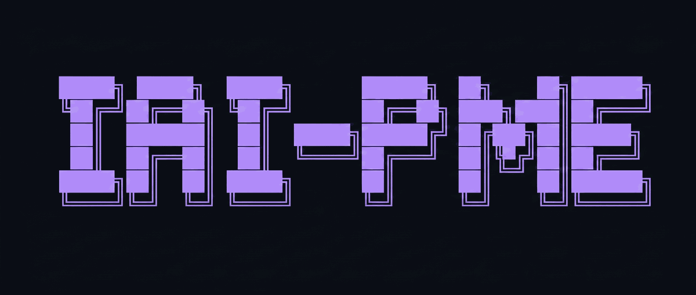

[English](./README.md) | **中文**

> 这是社区翻译，可能落后于英文版几个版本。最新内容请以 [English README](./README.md) 为准。欢迎提 PR 帮助保持同步。
>
> Community-maintained translation, may lag the English version. See [English README](./README.md) for the latest. PRs welcome.

---

<p align="center">
  
</p>

<h3 align="center">为 AI 编程助手打造的最佳开源个人记忆引擎。</h3>
<p align="center">每一项声明都附带可复现的基准测试脚本。你可以自己跑一遍验证。</p>

<p align="center">
  
  <a href="LICENSE"></a>
  
  
  
  
</p>
<p align="center">
  
  
  
  
  
  <a href="https://glama.ai/mcp/servers/CodeAbra/iai-mcp"></a>
</p>

---

# iai-pme

**你的 AI 助手每次会话都会忘记你。iai-pme 给它一个不会忘的记忆。**

*Independent Autistic Intelligence —— 个人记忆引擎。完全本地、环境无感、自动运行。兼容 Claude 以及其他支持 MCP 协议的客户端。*

## 目录

- [它是什么](#它是什么)
- [快速开始](#快速开始)
- [使用方式](#使用方式)
- [工作原理](#工作原理)
- [自研组件](#自研组件)
- [完整文档（英文）](#完整文档英文)

---

## 它是什么

一个本地服务，使用 [MCP 协议](https://modelcontextprotocol.io) 为 Claude（以及其他兼容 MCP 的助手）提供长期记忆。它逐字记录每个会话的每一轮对话，随着时间组织成关于你的个人地图，并在每次新会话开始时回传一小段相关记忆。你不需要说 *"记住这个"* 或 *"我们上次说了什么?"*。

我为自己做了这个工具。它有效。我已经每天用了好几个月，现在分享出来。基准测试主要是出于我自己的好奇心 —— 我想知道它是真的有效，还是只是我习惯了。

底层不是对别人家向量库和图库的薄薄一层封装 —— 关键部分都是我自己写的代码：存储引擎、社区发现算法、超维记忆基底，以及让它快起来的原生引擎。详见 [自研组件](#自研组件)。

不像云端记忆服务：没有 API key，没有账号，没有埋点。引擎、存储、嵌入全部本地运行。唯一离开你机器的数据，就是你的 CLI 客户端本来就会发出的那次模型调用。

---

## 快速开始

### 前置条件

- macOS（Apple Silicon）或 Linux
- Python 3.11 或 3.12
- Node.js 18+
- Rust 工具链 —— 原生引擎从源码构建
- 支持 MCP 的 CLI 客户端 —— [Claude Code](https://docs.claude.com/en/docs/claude-code/overview)、Codex CLI、Gemini CLI、Cursor CLI 等
- 约 500 MB 可用磁盘空间

支持 macOS 和 Linux。**Windows 即将支持。** 欢迎贡献：如果你想帮忙落地 Windows 支持，请开 issue 或 PR。

### 安装

```bash
git clone https://github.com/CodeAbra/iai-personal-memory-engine.git
cd iai-personal-memory-engine
python3.12 -m venv .venv && source .venv/bin/activate
pip install .
```

`pip install` 会通过 `setuptools-rust` 自动构建原生 Rust 引擎（`iai_mcp_native` —— 嵌入器 + 图核），作为包构建的一部分。没有单独的构建脚本。如果以后修改 Rust 源码需要手动重建：

```bash
iai-mcp build-native        # 原地重建原生引擎
```

然后构建 MCP wrapper 并启动本地引擎（在后台运行）：

```bash
cd mcp-wrapper && npm install && npm run build && cd ..
iai-mcp daemon install      # macOS 用 launchd，Linux 用 systemd
iai --version
```

### 安装捕获 + 召回钩子

这是让记忆变成"环境无感"的关键。没有这些钩子，iai-mcp 只能读取记忆，不会写入对话内容，也不会在会话开始时注入召回。一条命令搞定三个钩子：

```bash
iai-mcp capture-hooks install       # 复制全部三个钩子 + 修补 ~/.claude/settings.json
iai-mcp capture-hooks status        # 验证：应输出 "status: ACTIVE"
iai-mcp capture-hooks uninstall     # 干净卸载
```

Codex 用户：

```bash
iai-mcp capture-hooks install --target codex
```

两个都装：

```bash
iai-mcp capture-hooks install --target all
```

### 连接你的 MCP 客户端

Claude Code：

```bash
claude mcp add iai-mcp -- node "$(pwd)/mcp-wrapper/dist/index.js"
```

或者直接编辑 `~/.claude.json`：

```json
{
  "mcpServers": {
    "iai-mcp": {
      "command": "node",
      "args": ["/absolute/path/to/iai-mcp/mcp-wrapper/dist/index.js"]
    }
  }
}
```

使用绝对路径。`~` 和 `$HOME` 在这里不会展开。

Claude Desktop 用户编辑 `~/Library/Application Support/Claude/claude_desktop_config.json`。

### 验证

```bash
iai-mcp doctor
iai-mcp daemon status
```

重启 Claude Code。开始一次会话、做点事、退出。然后：

```bash
tail ~/.iai-mcp/logs/capture-$(date -u +%Y-%m-%d).log
```

你应该能看到一行 `rc=0`。这就是你的第一段记忆。

---

## 使用方式

会话过程中你不需要直接调用 `iai-mcp`。一旦连接好：

**捕获是自动的。** 每一轮对话（你的和助手的）都会被逐字记录，带时间戳和会话元数据。你不需要说 *"记住这个"*。

**召回是自动的。** 新会话开始时，本地引擎会组装一小段与当前相关的历史，注入到对话前缀里。你不需要问 *"我们上次说了什么"*。

**整合在闲时运行。** 会话之间，本地引擎合并重复内容、强化常被检索的路径、修剪弱连接。系统会随着时间悄悄变得更懂你。

几周日常使用之后差别会变得明显。助手不再问相同的定位问题，会引用你顺口提过的事，无需被告知就能适应你的风格。

还有一个 CLI —— 日常使用不需要它，但当你想直接从终端查询或添加记忆时，`iai` 提供了：`recall`、`capture`、`ask`（基于你的记忆做 LLM 综合回答）、`status`、`last`。

---

## 工作原理

本地引擎是一个在后台运行的 Python 进程 —— 闲时休眠，需要时被唤醒，所以不会一直在用 CPU。你的 MCP 客户端通过 Unix socket 连接它。不暴露任何网络端口。

召回不依赖引擎是否唤醒。存储本身始终可用：当引擎休眠或未运行时，你的助手（和 `iai` CLI）会直接从本地存储读取记忆。引擎只负责快速的无 LLM 召回路径，加上夜间整合 —— 它从不充当你记忆的看门人。

记忆分为三层：

**情景记忆（Episodic）** —— 对话内容的逐字片段，带时间戳。一次写入，永不覆盖或重写。

**语义记忆（Semantic）** —— 闲时整合期间，从相关情景的聚类中归纳出的摘要。

**程序性记忆（Procedural）** —— 一小组关于你的稳定参数，随时间习得：偏好、风格线索、反复出现的模式。11 个根据"什么管用"自我调整的封印式旋钮。

三层由一个超维记忆基底（hyperdimensional memory substrate）承载 —— 每种记忆有自己独立的表示，所以情景细节、语义要点、程序性模式不会被压成一个无差别的团块。

后台周期性运行一次（睡眠周期）：用我自己写的社区发现算法对情景做聚类、构建语义摘要、衰减未被强化的旧连接、强化被频繁共同检索的路径。你没再回顾过的事情会自然褪色。每晚最多发起一次 LLM 调用，**通过你已有的 Claude 订阅**（`claude -p`） —— 不需要单独的 API key，限制在你日均额度的 ≤1%。（`iai-mcp doctor` 的 (p) 项验证整个安装中没有任何 API-key SDK 路径。）

召回综合三种信号：语义相似度、图连接强度、时近性。三者一起排序。热路径完全本地运行，链路中没有 LLM。

所有记录在静态时使用 AES-256-GCM 加密。密钥放在 `~/.iai-mcp/.key`（mode 0600）。请备份。**密钥丢失 = 记忆丢失。**

一切都存放在 `~/.iai-mcp/`。嵌入在本地计算。唯一离开机器的数据，就是你的客户端本来就要调用的那次 LLM API 请求。

---

## 自研组件

大部分记忆类项目只是在现成的向量库和图库上面薄薄包一层。这个不是。承重的部分都是我自己写的代码，专门为这种工作负载设计 —— 一个小型记忆图，每晚变化，每次召回都会被查询：

| 组件 | 功能 |
|---|---|
| **Hippo** | 存储引擎 —— 加密记录、向量索引、图，全部在一个本地存储里。 |
| **MOSAIC** | 我的社区发现算法 —— Leiden 家族方法（CPM 目标函数），用纯 MIT 许可的 Python 重写，替代 GPL 协议的 `leidenalg`/`igraph` 依赖。它对记忆图做聚类，让召回能扩散到正确的邻域，让睡眠能重放连贯的情景 —— 专为小型、异构权重、每个周期都在变化的图调优，社区身份在拆分和合并中保持稳定。 |
| **Lilli HD** | 超维记忆基底 —— 情景 / 语义 / 程序性记忆各有独立表示，支持结构性召回（按记忆的*形状*召回，而不只是它的嵌入向量）。 |
| **Native engine** | Rust 内核 —— 嵌入器和图核。延迟主要来自这里。 |

这些组件构建在一层稳定的、宽松许可的基础库之上 —— SQLite、`candle` 张量库、NumPy、经过审计的 `cryptography` AES 实现。我自己写引擎和算法；我不重新发明数据库、张量内核 —— 也*故意*不重新发明加密原语。有趣的砖是我的，下面的地基是无聊、久经考验、宽松许可的。**全程 MIT。**

我写这些是因为现成的方案是为不同的问题设计的 —— 大型静态图、多租户云、要点式摘要 —— 它们对"一个人的记忆，在一台机器上，每晚重新组织"这个问题来说更慢、更不合适。我的版本在*这个形状*的问题上更快，而我只在乎这个形状。

---

## 完整文档（英文）

更多内容请见英文版 README：

- **基准测试细节**（LongMemEval-S 对比 mempalace、Rescue@10、漂移、整合、延迟、内存占用） → [README.md#benchmarks](./README.md#benchmarks)
- **配置项**（环境变量、调优旋钮） → [README.md#configuration](./README.md#configuration)
- **Doctor 自检**（25 项健康检查清单） → [README.md#doctor](./README.md#doctor)
- **故障排查** → [README.md#troubleshooting](./README.md#troubleshooting)
- **状态与限制** → [README.md#status-and-limitations](./README.md#status-and-limitations)
- **兼容性**（Claude Code / Codex CLI / Gemini CLI / Cursor CLI / Claude Desktop） → [README.md#compatibility](./README.md#compatibility)
- **关于命名**（Independent Autistic Intelligence 的含义） → [README.md#about-the-name](./README.md#about-the-name)

---

## License

[MIT](LICENSE)

## Authors

By Areg Aramovich Noya, in collaboration with the team at [lcgc.dev](https://lcgc.dev).
